# TenantHub AWS Deployment

## Architecture


TenantHub is deployed using a production-style AWS architecture with automated container delivery.

The application architecture consists of:

* Frontend static assets stored in Amazon S3
* Node.js backend API containerized using Docker
* Docker images stored in Amazon Elastic Container Registry (ECR)
* ECS Fargate running the backend service
* Application Load Balancer routing traffic to ECS tasks
* API Gateway exposing the public REST API
* DynamoDB providing persistent application storage
* AWS Systems Manager Parameter Store managing application secrets
* CloudWatch providing monitoring and application logs
* Paystack payment integration

---

# AWS Services Used

## Compute and Containers

* Amazon ECS Fargate
* Amazon Elastic Container Registry (ECR)
* Application Load Balancer (ALB)

## Storage and Database

* Amazon DynamoDB
* Amazon S3

## Networking

* Amazon API Gateway
* VPC Interface Endpoints

## Security

* AWS IAM
* AWS Systems Manager Parameter Store

## Monitoring

* Amazon CloudWatch

## CI/CD

* GitHub Actions
* GitHub OIDC IAM Role
* AWS CodeBuild (evaluated as an alternative CI/CD option)

## Frontend Delivery

* Amazon CloudFront (explored as a future enhancement)

---

# CI/CD Pipeline

TenantHub uses GitHub Actions to automate the container build and deployment workflow.

The final production pipeline:

```text
Developer
    |
    v
GitHub Repository
    |
    v
GitHub Actions
    |
    v
AWS IAM OIDC Role
    |
    v
Amazon ECR
    |
    v
ECS Fargate
    |
    v
Application Load Balancer
    |
    v
API Gateway
```

The deployment pipeline:

1. Developer pushes code to GitHub
2. GitHub Actions workflow starts
3. AWS authentication is performed using GitHub OIDC
4. Docker image is built
5. Docker image is tagged and pushed to Amazon ECR
6. ECS service is updated
7. ECS Fargate deploys the new container version

---

# Deployment Flow

1. Application developed locally
2. Docker image created
3. GitHub Actions builds container image
4. Image pushed to Amazon ECR
5. ECS Fargate service deployed
6. Application Load Balancer configured
7. API Gateway proxy integration created
8. DynamoDB connected
9. AWS Systems Manager secrets injected into ECS tasks
10. Paystack payment workflow tested
11. CloudWatch monitoring enabled

---

# ECS Deployment

The TenantHub backend API runs successfully on Amazon ECS Fargate.

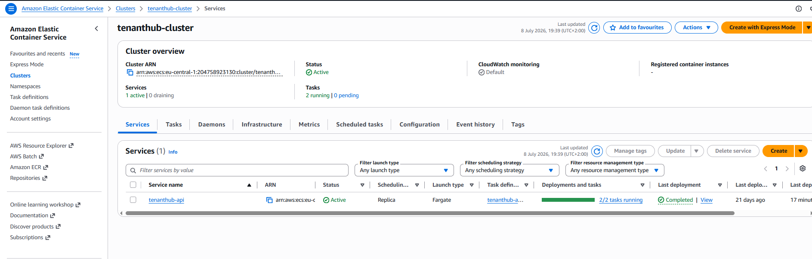

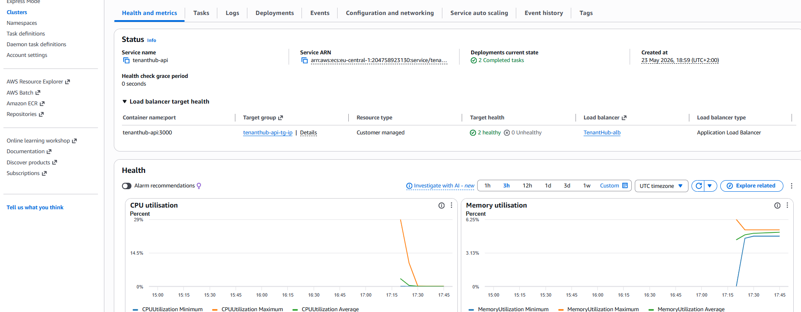

Validation command:

```bash
aws ecs describe-services \
--cluster tenanthub-cluster \
--services tenanthub-api \
--query 'services[0].[status,desiredCount,runningCount]'
```

Result:

```text
ACTIVE
2
2
```

The ECS service successfully maintained two running tasks.

---

# Container Registry

Docker container images are stored in Amazon Elastic Container Registry (ECR).

Deployment workflow:

```text
Docker Build
      |
      v
Amazon ECR Repository
      |
      v
ECS Task Definition
      |
      v
ECS Fargate Service
```

---

# GitHub Actions Authentication

GitHub Actions authenticates with AWS using OpenID Connect (OIDC).

This avoids storing long-lived AWS access keys inside GitHub.

Security implementation:

* GitHub Actions identity provider configured in IAM
* Dedicated IAM role created for CI/CD deployment
* Temporary AWS credentials issued during workflow execution
* Permissions restricted to required deployment resources

---

# Load Balancer

Traffic is routed through an Application Load Balancer before reaching ECS containers.

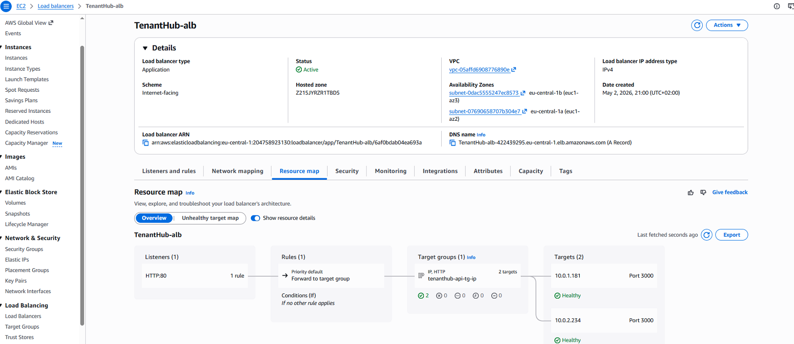

The ALB target group forwards requests to healthy ECS tasks running the TenantHub API.

---

# API Gateway

API Gateway provides the public REST API endpoint and forwards requests to the Application Load Balancer using HTTP proxy integration.

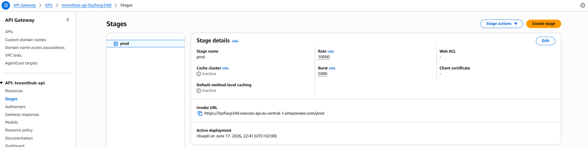

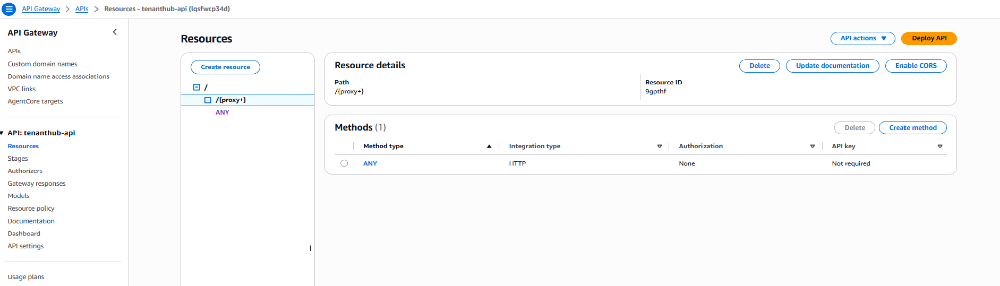

Request flow:

```text
Client
 |
API Gateway
 |
Application Load Balancer
 |
ECS Fargate
 |
Node.js API
```

Example endpoint:

```text
https://<api-id>.execute-api.eu-central-1.amazonaws.com/prod
```

---

# API Validation

## Health Check

Request:

```bash
curl $API_GW_URL/health
```

Response:

```json
{
  "status": "healthy",
  "service": "tenanthub-api",
  "timestamp": "2026-07-08T19:01:13.503Z"
}
```

---

## Tenant API

Request:

```bash
curl $API_GW_URL/api/tenants
```

Response:

```json
[
  {
    "plan": "pro",
    "email": "apigw@test.com",
    "name": "API GW Tenant"
  },
  {
    "plan": "free",
    "email": "test@example.com",
    "name": "Test Tenant"
  }
]
```

The API successfully retrieved tenant information from DynamoDB.

---

# Payment Verification

Paystack payment initialization and verification were successfully tested.

Verification request:

```bash
curl $API_GW_URL/api/payments/verify/th_d603a309-969
```

Response:

```json
{
  "reference": "th_d603a309-969",
  "amount": 5000,
  "currency": "NGN",
  "status": "success",
  "channel": "card",
  "customer": "test@example.com"
}
```

Payment records were stored successfully.

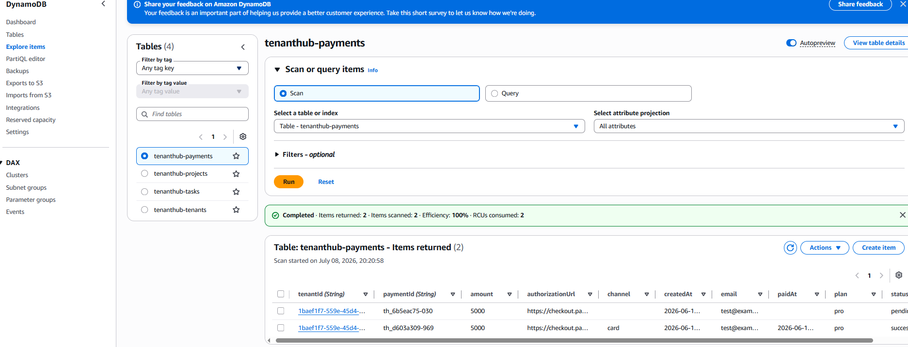

---

# Database Validation

Tenant records were successfully stored in DynamoDB.

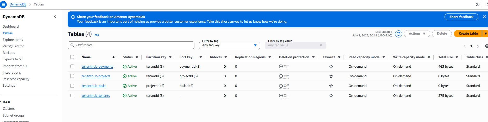

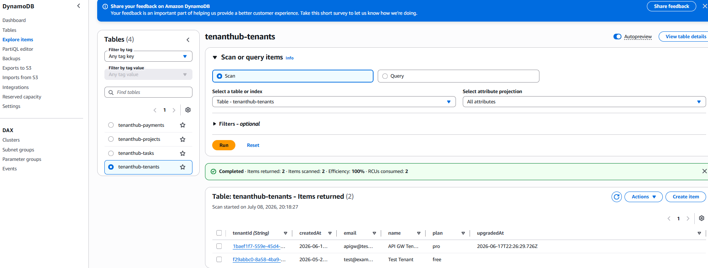

Validation command:

```bash
aws dynamodb scan \
--table-name tenanthub-tenants
```

Example result:

```json
{
  "Count": 2,
  "Items": [
    {
      "name": "API GW Tenant",
      "plan": "pro"
    },
    {
      "name": "Test Tenant",
      "plan": "free"
    }
  ]
}
```

---

# Secure Secrets Management

Sensitive credentials were not stored inside application source code.

Paystack credentials were injected into ECS tasks using AWS Systems Manager Parameter Store.

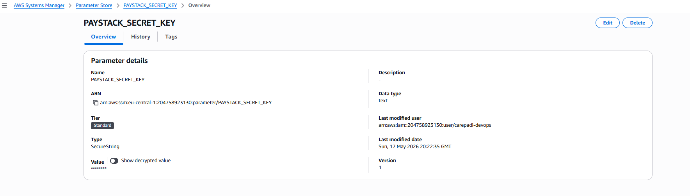

Implementation included:

* IAM permissions for ECS execution role
* SSM parameter access
* ECS task definition secret injection
* VPC endpoint connectivity

---

# Monitoring

Application monitoring and logs were implemented using Amazon CloudWatch.

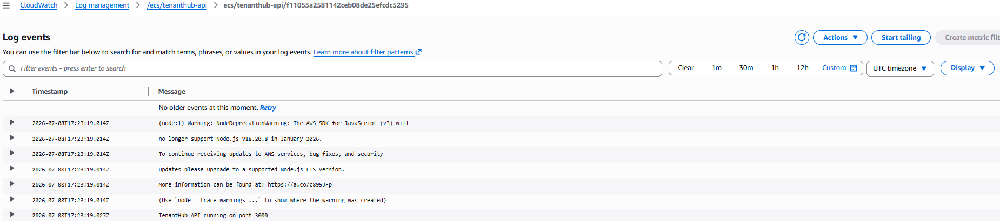

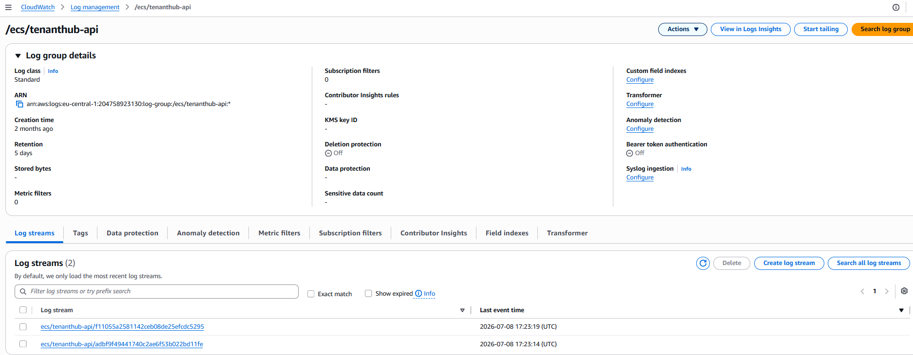

CloudWatch was used to verify:

* ECS container startup
* Application logs
* API requests
* Runtime behaviour

---

# Frontend Hosting

Frontend assets were uploaded to Amazon S3.

The planned frontend delivery architecture included:

```text
User
 |
CloudFront Distribution
 |
S3 Bucket
 |
Frontend Assets
```

The following CloudFront components were prepared:

* Amazon S3 frontend bucket
* CloudFront Origin Access Identity (OAI)
* S3 bucket policy restricting access

CloudFront distribution creation could not be completed because AWS account verification was required before additional CloudFront resources could be created.

The current completed deployment uses Amazon S3 for frontend asset storage.

Future enhancements:

* Enable CloudFront distribution
* Configure HTTPS custom domain
* Add Route 53 DNS management
* Implement frontend caching strategy

---

# Additional AWS Exploration

## AWS CodeBuild

AWS CodeBuild was evaluated as an alternative CI/CD build service.

The initial design included:

```text
GitHub Repository
        |
        v
AWS CodeBuild
        |
        v
Amazon ECR
        |
        v
ECS Fargate
```

Supporting resources were prepared:

* CodeBuild project configuration
* IAM service role policies
* Build specification (`buildspec.yml`)
* Deployment permissions

Due to AWS account restrictions during development, the final CI/CD pipeline used GitHub Actions instead.

The CodeBuild configuration files remain in the repository as reference material for future migration.

---

# Lessons Learned

## Container Deployment

Implemented a complete container workflow:

* Docker image creation
* GitHub Actions automation
* Amazon ECR image management
* ECS Fargate deployment

## Secure CI/CD Authentication

Implemented GitHub OIDC authentication instead of storing permanent AWS credentials.

## ECS Secret Injection

Used AWS Systems Manager Parameter Store for secure runtime configuration.

## VPC Networking

Configured VPC endpoints to allow ECS tasks to securely communicate with AWS services.

## API Gateway Integration

Implemented:

```text
Client
 |
API Gateway
 |
Application Load Balancer
 |
ECS Fargate
 |
Node.js Application
```

## IAM Least Privilege

Configured IAM permissions according to service requirements.

---

# Project Completion Summary

TenantHub was successfully deployed as a multi-tenant SaaS application on AWS.

Completed capabilities:

✅ Docker containerization
✅ GitHub Actions CI/CD pipeline
✅ GitHub OIDC AWS authentication
✅ Amazon ECR image management
✅ ECS Fargate production deployment
✅ Application Load Balancer routing
✅ API Gateway REST API
✅ DynamoDB persistence
✅ AWS Systems Manager secret injection
✅ VPC endpoint networking
✅ CloudWatch monitoring
✅ Paystack payment verification

Additional AWS technologies explored:

✅ AWS CodeBuild CI/CD architecture
✅ CloudFront S3 frontend delivery architecture

The project demonstrates a complete AWS DevOps lifecycle from source code commit, automated container delivery, cloud deployment, security configuration, and production validation.
